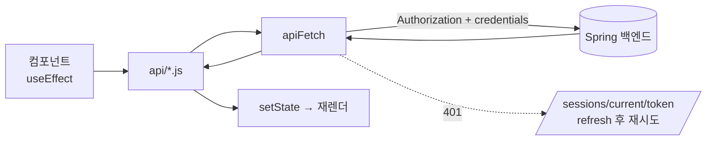

# 톡톡 FE — React 마이그레이션 설계 문서

> **Vanilla JS (MPA) → React (SPA)** 전환 설계
> 스택 결정: **Vite + React Router / JavaScript 유지 / `useEffect`+`useState` 직접 / 빅뱅 재작성**
> 대상: `talktalk-FE` · 작성 기준일: 2026-07-20

---

## 목차
0. 개요 (목표 · 스택 결정)
1. **기존 프로젝트 분석 — 주요 페이지와 기능**
2. **예상 컴포넌트 구조와 컴포넌트별 역할**
3. **상태와 데이터 흐름**
4. **단계별 마이그레이션 순서 및 AI 활용 작업 리스트**
- 부록: MPA→SPA 개념 변화 / 리스크

---

## 0. 개요

### 목표 / 비목표
- **목표**: 화면·기능·API 계약을 그대로 유지한 채 Vanilla JS MPA를 React SPA로 재작성한다. (리팩터링이 아닌 "포팅")
- **학습 목표**: 라이브러리에 의존하지 않고 `useState`/`useEffect`만으로 데이터 흐름·상태를 직접 다뤄본다.
- **비목표**: 신규 기능(채팅·알림), 백엔드 변경, 상태/데이터패칭 라이브러리(Redux/TanStack Query) 도입, SSR.

### 기술 스택 결정

| 구분 | 현재 (Vanilla) | 이후 (React) | 이유 |
|---|---|---|---|
| 렌더링 | HTML 문자열 + DOM 조작 | React + JSX | 선언적 UI |
| 프레임워크 | 없음 | **Vite + React Router** | 별도 Spring 백엔드 + 순수 SPA 구조에 최적 |
| 언어 | JavaScript(ESM) | **JavaScript 유지** | React 개념 학습에 집중 |
| 서버 데이터 | `apiFetch` + 페이지 스크립트 | **`useEffect`+`useState` 직접** | 캐싱·동기화를 직접 구현하며 원리 이해 |
| 스타일 | Tailwind v4 (CLI) | **Tailwind v4 유지** (Vite 플러그인) | 디자인 토큰·클래스 그대로 재사용 |
| 전략 | — | **빅뱅 재작성** | 규모 작음(~2,700줄), 점진 공존보다 단순 |

---

## 1. 기존 프로젝트 분석 — 주요 페이지와 기능

### 1-1. 전체 구조
```
index.html + pages/*.html (총 8화면)  ← 페이지마다 독립 HTML + 진입 JS
src/js/
├── api/        client(apiFetch) · auth · post · comment · user · image
├── components/ header · postCard · comment · confirmModal   (문자열 반환 + mount/bind)
├── pages/      화면별 진입 스크립트 (DOM 조회 → 이벤트 바인딩 → 상태는 모듈 변수)
├── utils/      validation · format · image · toast · modal · sessions · bfcache
└── constants/  config(API_BASE_URL) · httpStatus · messages
```

### 1-2. 화면별 기능 명세

| 화면 | 경로(현재) | 인증 | 핵심 기능 |
|---|---|---|---|
| **로그인** | `login.html` | ❌ | 이메일/비번 실시간 검증(`touched` 기반), 성공 시 토큰 저장 후 이동 |
| **회원가입** | `signup.html` | ❌ | 4필드 검증 + **이메일·닉네임 중복확인**(blur, 경쟁상태 가드), **프로필 이미지 즉시 업로드→id 확보** |
| **게시글 목록** | `index.html` | ✅ | **무한 스크롤**(IntersectionObserver + cursor), 카드 렌더, 글쓰기 진입 · (검색 input은 UI만, 로직 미구현) |
| **게시글 상세** | `post-detail.html?id=` | ✅ | 아래 1-3에 상세 (앱에서 가장 복잡) |
| **글쓰기** | `make-post.html` | ✅ | 제목/내용 필수 검증, **다중 이미지 업로드**(즉시 업로드→id, objectURL 미리보기, 썸네일 삭제), 작성 후 상세로 `replace` |
| **글수정** | `edit-post.html?id=` | ✅ | 기존 글 프리필 후 수정 (`updatePost`) |
| **프로필 수정** | `edit-profile.html` | ✅ | 내정보 로드, 닉네임 중복확인(원래 닉네임이면 스킵), 프로필 이미지 교체, **회원 탈퇴**(confirm→`withdraw`) |
| **비밀번호 수정** | `edit-password.html` | ✅ | 비번/비번확인 검증 후 변경(`updatePassword`) |

### 1-3. 게시글 상세 — 기능 분해 (가장 복잡, `post-detail.js` 508줄)
- **초기 로드**: `내정보 + 게시글`을 `Promise.all` 병렬 로드. `is_blinded`면 블라인드 표시.
- **이미지 캐러셀**: prev/next/dots, `translateX` 인덱스 이동.
- **좋아요**: **낙관적 토글** — 즉시 UI 반영 후 실패 시 롤백, 중복요청 방지(`likePending`).
- **소유권**: 내 글이면 수정/삭제 노출, 내 댓글이면 수정/삭제 노출(`data-writer-id`).
- **게시글 삭제**: `confirmModal`(Promise 기반) 확인 후 삭제.
- **댓글**: 목록 · **커서 페이지네이션**(더보기) · **작성**(낙관적, `data-optimistic`) · **인라인 수정**(`editingCommentId`로 폼 재사용) · **삭제**(confirm+낙관적) · Enter 제출 / Shift+Enter 줄바꿈 / IME 조합 처리.
- **대댓글(reply)**: 인라인 컴포저 동적 생성, 작성, **대댓글 더보기 페이지네이션**, 삭제된 댓글은 "삭제된 댓글입니다" 표시.

### 1-4. 공통 인프라
- **`apiFetch` (인터셉터)**: 토큰 주입 → 401이면 `/sessions/current/token`으로 refresh → 1회 재시도. 동시 401은 `refreshPromise`로 dedupe. FormData 자동 분기. → **React와 무관, 그대로 이식.**
- **인증**: accessToken은 `localStorage`, refresh는 httpOnly 쿠키. 각 페이지 상단 `if(!token) goLogin()` 가드.
- **전역 UI**: `showToast`(싱글턴 DOM), `confirmModal`(**Promise 반환** — `await confirmModal()`로 확인/취소 받음), `<dialog>` 기반 모달.
- **검증 유틸**: `validateEmail/Password/PasswordConfirm/Nickname` — 순수 함수, **그대로 재사용.**
- **API 응답 형태**: `{ ok, status, body }`, 데이터는 `body.data.*`. 목록·댓글은 `{ items, next_cursor }` 커서 구조.

---

## 2. 예상 컴포넌트 구조와 컴포넌트별 역할

### 2-1. 폴더 구조 (제안)
기존 타입 기반 구조가 익숙하므로 유지하되, `hooks/`·`contexts/`를 신설한다.
```
src/
├── main.jsx / App.jsx          진입점 · 라우터
├── api/                        ★ 무손실 이식 (client, auth, post, comment, user, image)
├── constants/ · utils/         ★ 무손실 이식 (format, validation, image / toast·modal·bfcache는 제거·재설계)
├── contexts/                   ★ 신규 — AuthContext, ToastContext
├── hooks/                      ★ 신규 — useInfiniteScroll, useForm, useOutsideClick, useConfirm
├── components/                 재사용 UI (아래)
└── pages/                      라우트 단위 페이지 (아래)
```

### 2-2. 라우트(페이지) 컴포넌트

| 컴포넌트 | 라우트 | 역할 | 대응 원본 |
|---|---|---|---|
| `LoginPage` | `/login` | 로그인 폼 | login.js |
| `SignupPage` | `/signup` | 가입 폼 + 중복확인 + 이미지 | signup.js |
| `PostListPage` | `/` | 무한스크롤 목록 | index.js |
| `PostDetailPage` | `/posts/:id` | 상세 컨테이너(하위 조합) | post-detail.js |
| `MakePostPage` | `/posts/new` | 글쓰기 | make-post.js |
| `EditPostPage` | `/posts/:id/edit` | 글수정(프리필) | edit-post.js |
| `EditProfilePage` | `/profile/edit` | 프로필 수정 + 탈퇴 | edit-profile.js |
| `EditPasswordPage` | `/profile/password` | 비번 수정 | edit-password.js |

### 2-3. 공통/구조 컴포넌트

| 컴포넌트 | 역할 | 원본 대비 변화 |
|---|---|---|
| `Layout` | 헤더 + `<Outlet/>` 감싸기 | **신규** — 헤더 중복 mount 제거 |
| `ProtectedRoute` | 미인증 시 `<Navigate to="/login" replace/>` | 페이지별 가드를 라우트로 승격 |
| `Header` | 로고·뒤로가기·프로필 드롭다운 | `classList.toggle`→`useState`, 외부클릭 훅 |
| `ToastViewport` | 토스트 렌더(Portal) | 싱글턴 DOM → Context+Portal |
| `ConfirmModal` | 확인/취소 다이얼로그 | Promise 방식 → `open/onConfirm/onCancel` props |

### 2-4. 도메인 컴포넌트 (상세 페이지 분해가 핵심)
`post-detail.js` 508줄을 **단일 페이지 → 작은 컴포넌트 트리**로 쪼갠다.

```
PostDetailPage (데이터 로드 · 소유권 계산)
├── PostImageCarousel      이미지 캐러셀 (지역상태: index)
├── PostBody               제목/본문/작성자/블라인드
├── LikeButton             좋아요 낙관적 토글 (지역상태: liked, count, pending)
├── PostActions            내 글일 때 수정/삭제
└── CommentSection         댓글 컨테이너 (목록·페이지네이션·작성)
    ├── CommentForm        작성/수정 겸용 (editingId)
    ├── CommentItem        댓글 1개 (수정/삭제/답글 토글)
    │   ├── ReplyList → ReplyItem
    │   └── ReplyComposer  답글 입력 (지역상태: open)
    └── LoadMoreButton     커서 더보기
```

| 컴포넌트 | 역할 | 대응 원본 |
|---|---|---|
| `PostCard` | 목록 카드(블라인드/카운트/작성자) | postCard.js — **순수함수라 JSX 변환만** |
| `CommentItem` | 댓글 + 소유권 액션 + 답글 진입 | comment.js `commentItem` |
| `ReplyItem` | 대댓글 1개 | comment.js `replyItem` |

> **분해 원칙**: "상태를 소유하는 최소 단위"로 쪼갠다. 좋아요 상태는 `LikeButton`, 캐러셀 index는 `Carousel`, 편집중 댓글 id는 `CommentSection`이 갖는다. 원본의 전역 모듈 변수(`liked`, `editingCommentId`, `commentCursor`…)가 **각 컴포넌트의 `useState`로 분산**되는 것이 핵심 변화.

---

## 3. 상태와 데이터 흐름

### 3-1. 상태 3분류

| 분류 | 예시 | 저장 위치 |
|---|---|---|
| **전역 상태** | 로그인 유저(`user`), 토큰 유무 / 토스트 큐 | **Context** (AuthContext, ToastContext) |
| **서버 상태** | 게시글 목록·상세, 댓글, 내정보 | **페이지 로컬** `useState` + `useEffect` 패칭 |
| **지역 UI 상태** | 폼 입력값·touched, 캐러셀 index, 드롭다운 open, 좋아요 낙관적, 편집중 id, 답글창 open | **컴포넌트 로컬** `useState` |

### 3-2. 데이터 흐름 (변화 없음 — 계층만 유지)

컴포넌트는 `api/post.js` 같은 도메인 함수만 호출하고, 토큰·refresh는 `apiFetch`가 계속 책임진다. **바뀌는 건 "결과를 DOM에 꽂던 것"이 "`setState` 하는 것"으로 대체되는 부분뿐.**

### 3-3. 서버 데이터 패칭 표준 패턴 (라이브러리 없이)
```js
const [data, setData] = useState(null)
const [loading, setLoading] = useState(true)
const [error, setError] = useState(null)

useEffect(() => {
  let alive = true                     // ★ 경쟁상태/언마운트 가드
  getPost(id).then(res => {
    if (!alive) return
    res.ok ? setData(res.body.data) : setError(res.status)
  }).finally(() => alive && setLoading(false))
  return () => { alive = false }
}, [id])
```
**직접 구현하며 배우는 것** (라이브러리가 대신하던 것): 경쟁상태 방지, 로딩/에러/성공 3상태, refetch 트리거, 반복 패턴의 훅 추출.

### 3-4. 낙관적 업데이트 (좋아요 · 댓글) — 흐름 유지
원본의 "즉시 반영 → 실패 시 롤백"을 **상태로** 표현:
```
사용자 클릭
 → setLiked(next); setCount(c => c ± 1)     // 낙관적 반영
 → await likePost(); 실패 시 → 이전 값으로 setState 롤백
```
현재 수동 DOM 롤백(`renderLike()`) → `useState` 되돌리기로 대체. 로직 자체는 동일.

### 3-5. Context 경계 (props drilling 최소화)
- **AuthContext**: `user`, `isAuthenticated`, `login()`, `logout()`. → Header(아바타), ProtectedRoute, 상세페이지 소유권 판단에서 소비. **원본에서 페이지마다 `getMyInfo()` 부르던 중복 요청을 1회로 제거.**
- **ToastContext**: `showToast(msg, type)`. → 어디서든 `useToast()`로 호출.
- 그 외 상태는 Context에 올리지 않고 지역에 둔다(과도한 전역화 경계).

### 3-6. 로그아웃 시 주의 (SPA 특성)
MPA에선 새로고침이 상태를 날렸지만 SPA는 아니다. 로그아웃 시 **토큰 제거 + AuthContext user 초기화**를 명시적으로 해야 잔여 상태가 남지 않는다.

---

## 4. 단계별 마이그레이션 순서 및 AI 활용 작업 리스트

> **AI 활용 원칙 (학습 프로젝트)**
> - 🟢 **AI 위임 OK**: 기계적 변환·보일러플레이트·설정 (배움이 적고 반복적인 것)
> - 🟡 **AI 초안 + 직접 이해**: 초안 받되 반드시 읽고 손봄
> - 🔴 **직접 작성 (핵심 학습)**: 상태 설계·데이터 흐름·훅 — AI는 **리뷰/힌트만**

| 단계 | 작업 | AI 활용 | 비고 |
|---|---|---|---|
| **0. 스캐폴딩** | Vite+React 생성, Tailwind v4 Vite 플러그인, `globals.css` 이식, `import.meta.env.VITE_API_BASE_URL` 전환 | 🟢 | 설정은 AI로 빠르게 |
| **1. 무손실 이식** | `api/*`, `constants/*`, `utils/format·validation·image` 복사 | 🟢 | 로직 변경 없음 |
| **2. 라우터 뼈대** | `App.jsx` 라우트 정의, `Layout`, `ProtectedRoute` | 🟡 | 구조는 AI, 가드 동작은 직접 이해 |
| **3. 인증 기반** | `AuthContext`(login/logout/user), 토큰 저장소 | 🔴 | **핵심** — 전역 상태 설계 직접 |
| **4. 로그인/회원가입** | 폼 **제어 컴포넌트** 전환, 검증 유틸 연결, 중복확인(경쟁상태) | 🔴 | React 폼 사고방식 체득 |
| **5. 목록 페이지** | `PostList` + `PostCard`(JSX 변환) + **무한스크롤 훅** | PostCard 🟢 / 훅 🔴 | `useInfiniteScroll` 직접 |
| **6. 상세 페이지** | 컴포넌트 트리 분해, 데이터 로드, **좋아요 낙관적**, 소유권 | 🔴 | 앱의 심장 — 직접 |
| **7. 댓글/대댓글** | `CommentSection` 트리, 페이지네이션, 낙관적 작성/수정/삭제 | 🟡 | JSX는 AI, 상태 로직 직접 |
| **8. 글쓰기/수정** | 필수검증, 다중 이미지 업로드+미리보기(objectURL revoke) | 🟡 | 업로드 흐름 직접 이해 |
| **9. 프로필/비번** | 내정보 프리필, 닉네임 중복확인, 탈퇴 | 🟡 | 4번 패턴 재사용 |
| **10. 전역 UI** | `ToastContext`+Portal, `ConfirmModal`(Promise→props/훅) | 🟡 | Portal·Promise 훅 개념 |
| **11. 정리** | 공통 훅 추출(`useForm`, `useOutsideClick`, `useConfirm`), 중복 제거 | 🟡 | AI로 리팩터링 후보 탐색 |
| **12. 검증** | 기존 MPA와 화면·동작 대조, CORS/쿠키·SPA fallback 확인 | 🟢 | 체크리스트화 |

### 4-1. "직접 작성"으로 남기는 학습 포인트 (🔴)
- `useEffect` 의존성 배열 + cleanup(경쟁상태)
- 낙관적 업데이트 롤백을 `setState`로 표현
- 전역 모듈 변수 → 컴포넌트별 `useState` 분산 설계
- Context 경계 결정 (무엇을 전역에 올릴지)
- 커스텀 훅으로 반복 로직 추출

### 4-2. AI에게 맡길 때의 구체 프롬프트 감각
- 🟢 "이 `postCard.js` 문자열 템플릿 함수를 동일한 마크업의 React 컴포넌트로 변환해줘 (로직 추가 금지)"
- 🟡 "이 `useEffect` 데이터 패칭에서 경쟁상태 이슈가 있는지 리뷰만 해줘 (코드는 내가 고침)"
- 🔴 상태 설계는 **먼저 내가 짜고** → "이 상태 구조 개선점만 지적해줘"

---

## 부록 A. MPA → SPA 개념 변화 (그냥 문법 번역이 아닌 지점)

| 현재 | SPA | 처리 |
|---|---|---|
| 페이지 이동 = 전체 새로고침 | 컴포넌트 스왑 | `<Link>` / `useNavigate` |
| 헤더가 페이지마다 재mount + 아바타 재요청 | 헤더 1회 유지 | `Layout` + AuthContext |
| `bfcache.js` 강제 리로드 | 불필요 | **삭제** |
| 페이지 상단 `if(!token)` 가드 | 라우트 가드 | `ProtectedRoute` |
| `?id=` 수동 파싱 | 라우트 파라미터 | `useParams()` |
| `window.location.href` | 클라이언트 네비 | `navigate()` |
| 싱글턴 toast/modal DOM | 트리 밖 렌더 | Context + `createPortal` |
| `element.disabled = true` | 파생 상태 | `useState` |
| `confirmModal()` Promise await | 선언적 모달 | `open`+콜백 또는 `useConfirm` 훅 |

## 부록 B. 리스크 · 주의점
1. **useEffect 경쟁상태**: cleanup 플래그 필수 (상세→목록 빠른 이동 시).
2. **StrictMode 이중 실행**: 개발 모드 effect 2회 — 정리(observer/타이머) 안 하면 버그.
3. **인증 리다이렉트 루프**: `ProtectedRoute` ↔ 로그인 간 `replace` 사용.
4. **CORS/쿠키**: `credentials:"include"` 유지, Vite dev 포트 바뀌니 백엔드 허용 오리진·SameSite 재확인.
5. **SPA 새로고침 404**: `/posts/3` 직접 접근 시 서버 fallback(index.html) — 배포 시 설정.
6. **환경변수**: `API_BASE_URL` → `import.meta.env.VITE_*`.

## 부록 C. 개념 매핑 치트시트

| Vanilla JS | React |
|---|---|
| `getElementById` | `useRef` / 상태 |
| `addEventListener` | `onClick` 등 props |
| `innerHTML =` | JSX 반환 |
| `classList.toggle` | `useState` + 조건부 클래스 |
| 모듈 최상단 변수 | `useState` / `useRef` |
| `location.href` | `useNavigate()` |
| `?id=` 파싱 | `useParams()` |
| 페이지 로드 = 초기화 | `useEffect(() => {}, [])` |
| 싱글턴 DOM | Context + `createPortal` |
